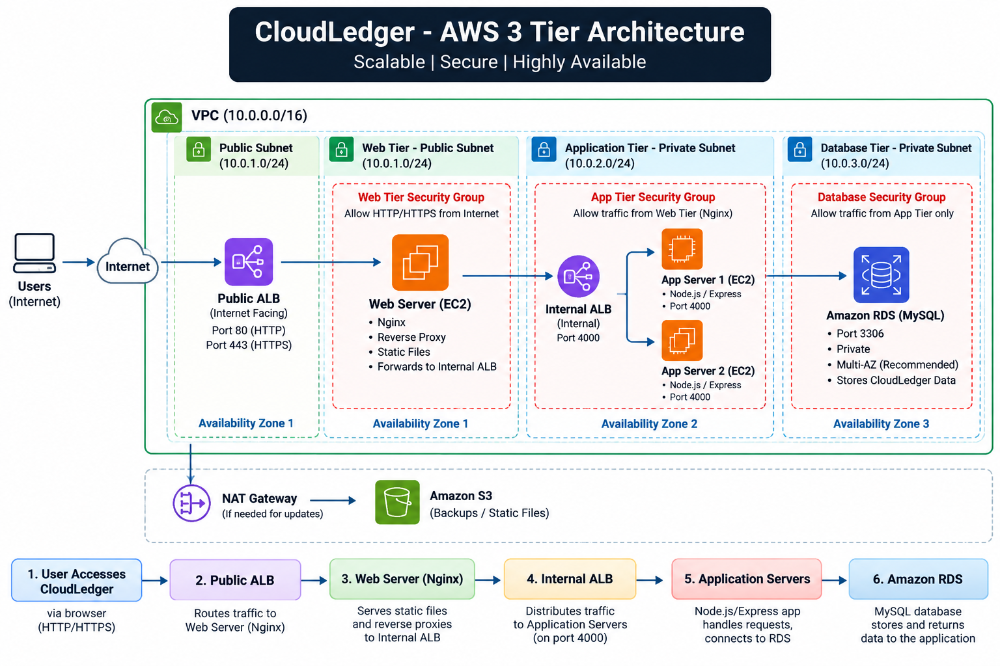

# CloudLedger – AWS 3-Tier Web Application


CloudLedger is a cloud-based financial management web application deployed using a 3-tier architecture on Amazon Web Services (AWS).


The project demonstrates the use of AWS networking, load balancing, EC2, Auto Scaling, Nginx, Node.js, and MySQL to build a structured and scalable web application.


---


## Project Overview


CloudLedger provides a web interface for managing financial information, including:


- Dashboard

- Transactions

- Budget

- Analytics


The application was designed using separate Web, Application, and Database tiers.


The AWS environment was successfully deployed and tested end-to-end. After testing and documentation, the AWS resources were decommissioned to avoid unnecessary ongoing cloud charges.


---


## Architecture


```text

                         Internet

                            |

                            v

                    +----------------+

                    |   Public ALB   |

                    +----------------+

                            |

                            v

                    +----------------+

                    |    Web Tier    |

                    |     Nginx      |

                    +----------------+

                            |

                            v

                    +----------------+

                    |  Internal ALB  |

                    +----------------+

                            |

                            v

              +---------------------------+

              |     Application Tier      |

              |                           |

              |  App Server 1   App 2    |

              |      Node.js / Express    |

              |        Port 4000          |

              +---------------------------+

                            |

                            v

                    +---------------+

                    |  Database Tier |

                    |   MySQL / RDS  |

                    +---------------+


```
### Architecture Diagram




---


## AWS Services Used


- Amazon VPC

- Amazon EC2

- Amazon RDS

- Application Load Balancer

- Auto Scaling

- NAT Gateway

- Internet Gateway

- Route Tables

- Security Groups

- AWS Systems Manager (SSM)

- Amazon S3

- Nginx


---


## Technology Stack


### Frontend


- HTML

- CSS

- JavaScript


### Backend


- Node.js

- Express.js


### Database


- MySQL

- Amazon RDS


### Web Server


- Nginx


### Cloud Platform


- Amazon Web Services (AWS)


---


## 3-Tier Architecture


### 1. Web Tier


The Web Tier acts as the entry point for users.


Nginx was configured as a reverse proxy and forwarded application requests to the Internal Application Load Balancer.


### 2. Application Tier


The Application Tier contains the Node.js/Express application.


Application servers run on port `4000` and are registered behind the Internal Application Load Balancer.


The application target group was successfully tested with two healthy application targets.


### 3. Database Tier


The Database Tier uses MySQL on Amazon RDS.


The application communicates with the database through the private application infrastructure.


---


## Load Balancing


The project uses two Application Load Balancers.


### Public Application Load Balancer


The Public ALB receives incoming traffic from users and forwards requests to the Web Tier.


### Internal Application Load Balancer


The Internal ALB receives requests from the Web Tier and distributes application traffic across the Application Tier.


---


## Nginx Reverse Proxy


Nginx was configured on the Web Tier as a reverse proxy.


The request flow was:


```text

User

  |

  v

Public ALB

  |

  v

Nginx Web Tier

  |

  v

Internal ALB

  |

  v

Node.js Application

  |

  v

MySQL Database


---


```
## Auto Scaling


Auto Scaling was configured for the application infrastructure to support multiple application instances and improve availability.


The application target group was tested with healthy application targets.


---


## Security


Security Groups were used to control communication between the different application tiers.


The architecture was designed so that private application and database resources were not directly exposed to the public internet.


---


## Testing and Verification


The complete application path was tested during deployment.


The following components were verified:


- Public ALB connectivity

- Web Tier connectivity

- Nginx reverse proxy

- Internal ALB

- Application servers

- Application health endpoint

- API endpoints

- Database connectivity

- CloudLedger frontend

- Transaction data retrieval


The Application Target Group reached:


```text

2 / 2 Healthy Targets

The CloudLedger frontend was successfully accessed through the Public ALB and was able to retrieve database records through the multi-tier architecture.


---


```
## Troubleshooting


Several issues were encountered and resolved during development, including:


- EC2 connectivity problems

- AWS Systems Manager session timeouts

- Application startup issues

- Nginx reverse proxy configuration

- ALB health check issues

- Application Target Group health issues

- Multiple application server registration

- Backend API verification

- Private-tier connectivity

- Git and GitHub authentication issues


These troubleshooting steps helped validate the complete AWS architecture.


---


## Project Screenshots


The project documentation includes screenshots covering:


1. [VPC Configuration](screenshots/01_vpc.png)
2. [Subnets](screenshots/02_subnets.png)
3. [Route Tables](screenshots/03_route_tables.png)
4. [Route Table 1](screenshots/04_route_table_1.png)
5. [Route Table 2](screenshots/05_route_table_2.png)
6. [Internet Gateway](screenshots/06_internet_gateway.png)
7. [NAT Gateway](screenshots/07_nat_gateway.png)
8. [Application Load Balancer](screenshots/08_application_load_balancer.png)
9. [Database Configuration](screenshots/09_database_configuration.png)
10. [Internal Web Configuration](screenshots/10_internal_web_configuration.png)
11. [Web Security Group](screenshots/11_web_security_group.png)
12. [Web Tier](screenshots/12_web_tier.png)
13. [RDS Configuration](screenshots/13_rds.png)
14. [Application Server 1](screenshots/14_application_server_1.png)
15. [Application Server 2](screenshots/15_application_server_2.png)
16. [Web Auto Scaling](screenshots/16_web_auto_scaling.png)
17. [Application Auto Scaling](screenshots/17_application_auto_scaling.png)
18. [Nginx Configuration](screenshots/18_nginx_configuration.png)
19. [Application Target Group](screenshots/19_application_target_group.png)
20. [Web Target Group](screenshots/20_web_target_group.png)
21. [Internal ALB](screenshots/21_internal_alb.png)
22. [Public ALB](screenshots/22_public_alb.png)
23. [Auto Scaling Group](screenshots/23_auto_scaling_group.png)


---


## Project Status


**Deployment:** Completed and tested


**End-to-end verification:** Completed


**AWS environment:** Decommissioned after testing


The AWS resources were decommissioned after testing to avoid unnecessary ongoing cloud charges.


---


## Learning Outcomes


Through this project, I gained practical experience with:


- AWS VPC networking

- Public and private subnets

- Application Load Balancers

- EC2

- Auto Scaling

- Amazon RDS

- Nginx reverse proxy

- Security Groups

- AWS Systems Manager

- Node.js application deployment

- Multi-tier cloud architecture

- Cloud troubleshooting

- Git and GitHub


---


## Future Improvements


Possible future improvements include:


- HTTPS using AWS Certificate Manager

- Route 53 domain integration

- CloudWatch monitoring and alarms

- CI/CD pipeline

- Infrastructure as Code using Terraform

- Docker containerization

- Improved authentication and authorization

- Automated database backups


---


## Author


**Vedant Shende**


BCA Student | Cloud & DevOps Enthusiast


---


## Disclaimer


This project was created for educational and portfolio purposes.


The AWS infrastructure used during development was decommissioned after testing to avoid unnecessary cloud costs.
